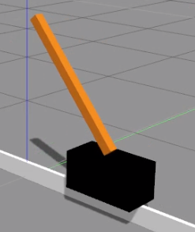

CartPole Environment
====================

This is a 3D version of the classical **cartpole** controle system.

   Cartpole in ROSDS.

Robot Environment
*****************

openai_ros_b.robot_envs.cartpole_env module
-----------------------------------------

.. automodule:: openai_ros_b.robot_envs.cartpole_env
    :members:
    :undoc-members:
    :show-inheritance:

Task Environments
*****************

.. toctree::
   :maxdepth: 4

   openai_ros_b.task_envs.cartpole_stay_up
